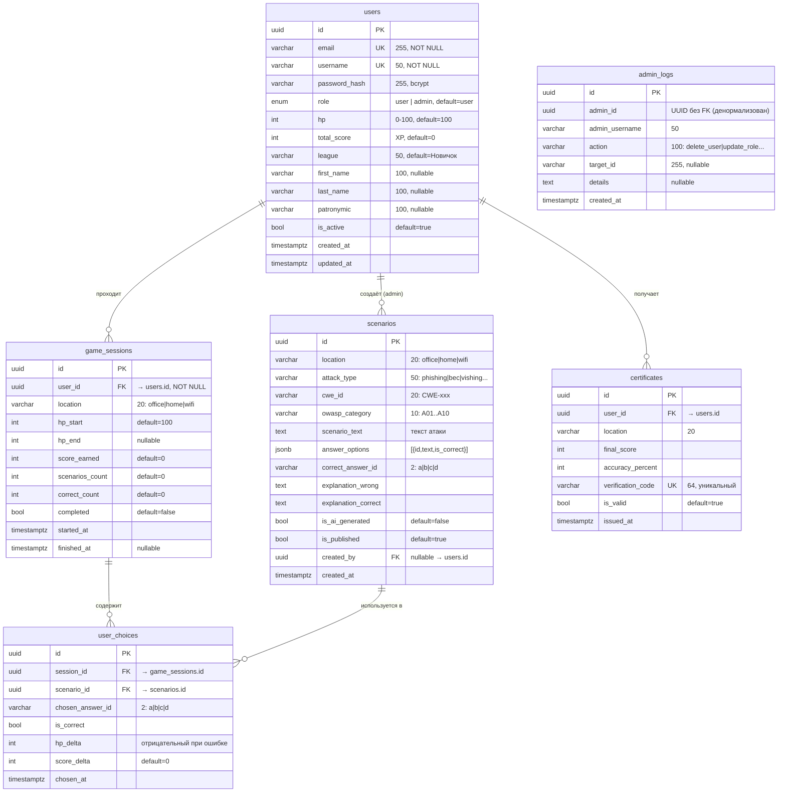

# База данных CyberGuard — ER-диаграмма

> PostgreSQL 16 · SQLAlchemy ORM (async) · Alembic migrations

## Диаграмма



## Таблицы

### `users`
Основная таблица пользователей. Хранит аутентификационные данные, игровую статистику и личные данные.

| Поле | Тип | Описание |
|------|-----|----------|
| `id` | UUID PK | auto uuid4 |
| `email` | VARCHAR(255) UNIQUE | адрес электронной почты |
| `username` | VARCHAR(50) UNIQUE | игровой никнейм |
| `password_hash` | VARCHAR(255) | bcrypt-хеш пароля |
| `role` | ENUM | `user` или `admin` |
| `hp` | INTEGER | очки здоровья 0–100 |
| `total_score` | INTEGER | накопленный XP |
| `league` | VARCHAR(50) | ранг: Новичок / Осведомлённый / Защитник / Эксперт |
| `first_name` | VARCHAR(100) | имя (для сертификата) |
| `last_name` | VARCHAR(100) | фамилия |
| `patronymic` | VARCHAR(100) | отчество |
| `is_active` | BOOLEAN | активен ли аккаунт |
| `created_at` | TIMESTAMPTZ | |
| `updated_at` | TIMESTAMPTZ | auto-update |

**Индексы:** `email`, `username`

---

### `scenarios`
Сценарии атак. Создаются вручную (admin), сидируются при старте, либо сохраняются из AI-генерации.

| Поле | Тип | Описание |
|------|-----|----------|
| `id` | UUID PK | |
| `location` | VARCHAR(20) | `office` \| `home` \| `wifi` |
| `attack_type` | VARCHAR(50) | тип атаки (phishing, bec, …) |
| `cwe_id` | VARCHAR(20) | идентификатор CWE |
| `owasp_category` | VARCHAR(10) | категория OWASP Top 10 |
| `scenario_text` | TEXT | текст ситуации |
| `answer_options` | JSONB | `[{id, text, is_correct}]` — 4 варианта |
| `correct_answer_id` | VARCHAR(2) | id правильного ответа |
| `explanation_wrong` | TEXT | объяснение при ошибке |
| `explanation_correct` | TEXT | объяснение при верном ответе |
| `is_ai_generated` | BOOLEAN | сгенерирован ли Mistral AI |
| `is_published` | BOOLEAN | опубликован ли |
| `created_by` | UUID FK → users | автор (admin), nullable |

**Индексы:** `location`, `attack_type`, `is_published`

---

### `game_sessions`
Одна игровая сессия пользователя (один уровень).

| Поле | Тип | Описание |
|------|-----|----------|
| `id` | UUID PK | |
| `user_id` | UUID FK → users | |
| `location` | VARCHAR(20) | уровень: office / home / wifi |
| `hp_start` | INTEGER | HP в начале сессии |
| `hp_end` | INTEGER | HP в конце, nullable |
| `score_earned` | INTEGER | заработанный XP |
| `scenarios_count` | INTEGER | кол-во сценариев |
| `correct_count` | INTEGER | кол-во верных ответов |
| `completed` | BOOLEAN | завершена ли сессия |
| `started_at` | TIMESTAMPTZ | |
| `finished_at` | TIMESTAMPTZ | nullable |

**Индексы:** `user_id`

---

### `user_choices`
Каждый ответ пользователя в рамках сессии.

| Поле | Тип | Описание |
|------|-----|----------|
| `id` | UUID PK | |
| `session_id` | UUID FK → game_sessions | |
| `scenario_id` | UUID FK → scenarios | |
| `chosen_answer_id` | VARCHAR(2) | выбранный вариант (a/b/c/d) |
| `is_correct` | BOOLEAN | |
| `hp_delta` | INTEGER | изменение HP (отрицательное при ошибке) |
| `score_delta` | INTEGER | заработанные очки |
| `chosen_at` | TIMESTAMPTZ | |

**Индексы:** `session_id`

---

### `certificates`
Выданные сертификаты.

| Поле | Тип | Описание |
|------|-----|----------|
| `id` | UUID PK | |
| `user_id` | UUID FK → users | |
| `location` | VARCHAR(20) | за какой уровень |
| `final_score` | INTEGER | итоговый счёт |
| `accuracy_percent` | INTEGER | точность % |
| `verification_code` | VARCHAR(64) UNIQUE | публичный код верификации |
| `is_valid` | BOOLEAN | действителен ли |
| `issued_at` | TIMESTAMPTZ | |

---

### `admin_logs`
Лог действий администраторов.

| Поле | Тип | Описание |
|------|-----|----------|
| `id` | UUID PK | |
| `admin_id` | UUID | ID администратора (денормализован) |
| `admin_username` | VARCHAR(50) | username на момент действия |
| `action` | VARCHAR(100) | `delete_user` / `update_role` / `edit_user` / `update_status` |
| `target_id` | VARCHAR(255) | ID затронутого объекта |
| `details` | TEXT | дополнительная информация |
| `created_at` | TIMESTAMPTZ | |

**Индексы:** `admin_id`, `created_at`

## Ранги (leagues)

| Ранг | XP порог | Уровень |
|------|----------|---------|
| Новичок | 0 | 1 |
| Осведомлённый | 300 | 3 |
| Защитник | 800 | 6 |
| Эксперт | 1 200 | 10 |

## Прогрессия уровней

```
ОФИС (всегда открыт)
  → ДОМ (открывается при league ≠ "Новичок", т.е. 300+ XP)
    → WI-FI (открывается после прохождения home сессии)
      → СЕРТИФИКАТ PDF (генерируется после home)
```
